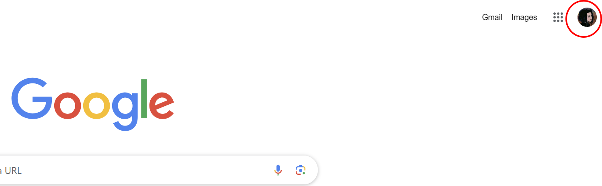
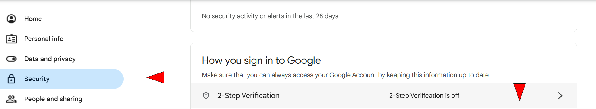
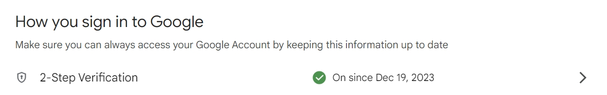
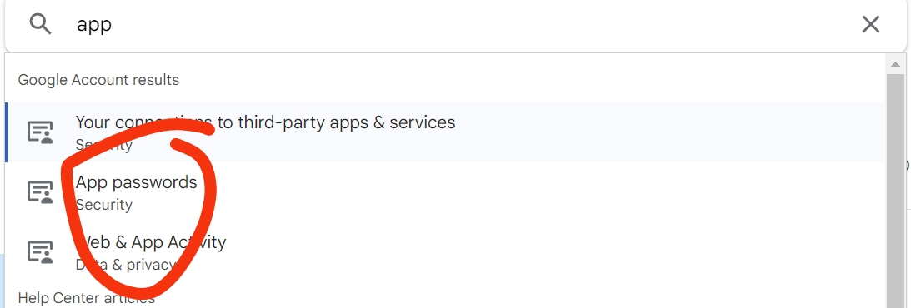
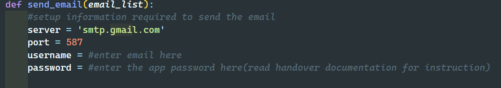
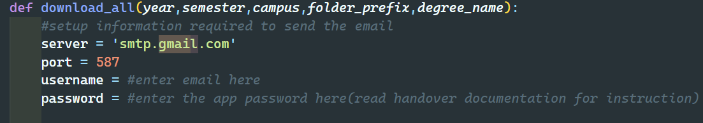

# IT-project
Github for IT project, viva team MacdonaldLover!!!

**Team Members:**

Yueyue Ma, Roujia Feng, Deyulin Chen, Ren Jie Yeo, Jieyang Zhu

## Table of Contents

1. [Project Overview](#project-overview)
2. [Demo](#demo)
3. [Documents](#documents)
4. [Test Cases](#test-cases)
5. [Changelog (or Release History)](#changelog-or-release-history)
6. [Key Algorithms](#key-algorithms)
7. [System Requirements](#system-requirements)
8. [Application Architecture](#application-architecture)
   - [Key Classes & Layers of the Application](#key-classes--layers-of-the-application)
9. [Email Setup Guide **(IMPORTANT!!)**](#email-setup-guide-important)
10. [Database Structure](#database-structure)
    - [Time-Sensitive Data](#time-sensitive-data)
    - [Non-Time-Sensitive Data](#non-time-sensitive-data)
11. [Deployment Guidelines](#deployment-guidelines)
    - [Current Deployment](#current-deployment)
    - [Modifying Packages](#modifying-packages)
    - [Deploying on a New Server](#deploying-on-a-new-server)
    - [Database Access and Root Permissions](#database-access-and-root-permissions)
    - [Email Configuration](#email-configuration)
12. [Licensing](#licensing)
    - [MongoDB](#mongodb)
    - [Email](#email)
    - [Render](#render)
13. [Access and Permissions](#access-and-permissions)
    - [Repositories](#repositories)


---

## Project Overview
This project is designed to streamline timetable management across campuses at the Victorian Institute of Technology (VIT). It allows administrators to modify classroom and lab capacities, upload enrollment files, and auto-generate timetables with conflict detection. The system supports downloadable timetables in Excel format and automated email distribution to students. It also offers user management, enabling admins to create and manage accounts. Additionally, it stores data from previous semesters for future use and provides tools to manually manage classroom locations, ensuring efficient scheduling and resource allocation.

---

## Demo
This is our deployment link: [VIT Timetable System](https://it-project-timetable.onrender.com/)

(*our delpoyment is currently on this [branch](https://github.com/dinosauryeo/IT-project/tree/feature/StudentTimetableAndHomeListInfo) )

This is our user manual: [VIT Timetable System User manual](docs/VIT_User_manual.pdf)

---

## Documents
[User Stories](docs/MacdonaldL-UserStories.pdf)

[Personas](docs/MacdonaldL-Personas.pdf)

[Motivational Model](docs/MacdonaldL-MotivationalModel.pdf)

[Use Case Diagram](docs/MacdonaldL-UseCaseDiagram.pdf)

[Process View](docs/MacdonaldL-ProcessView..pdf)

[System Architecture Diagram](docs/MacdonaldL-SystemArchitecturediagram.pdf)

[System Requirement](docs/MacdonaldL-SystemRequirement.pdf)

[Architecture Goals](docs/MacdonaldL-ArchitectureGoals.pdf)

[Domain Model](docs/MacdonaldL-DomainModel.pdf)

[SSD Login](docs/MacdonaldL-SSDlogin.pdf)

[SSD Upload and Display Timetable](docs/MacdonaldL-SSDUploadAndDisplayTimetable.pdf)

[SSD Add Course](docs/MacdonaldL-SSDAddCourse.pdf)

[VIT Timetable System User manual](docs/VIT_User_manual.pdf)

[Tool Version Requirement](requirement.txt)

## Test Cases
[Test Degree](tests/test_degree.py)

[Test Email](tests/test_email.py)

[Test Location](tests/test_location.py)

[Test Subject](tests/test_subject.py)

[Test Timetable Upload](tests/test_timetable_upload.py)

[Test User](tests/test_user.py)


## Changelog (or Release History)

- [Version 4.0.0](https://github.com/dinosauryeo/IT-project/releases/tag/Version4.0.0)
- [Version 3.0.0](https://github.com/dinosauryeo/IT-project/releases/tag/Version3.0.0)
- [Version 2.0.0](https://github.com/dinosauryeo/IT-project/releases/tag/Version2.0.0)
- [Version 1.0.0](https://github.com/dinosauryeo/IT-project/releases/tag/Version1.0.0)

---

## Key Algorithms

The code first connects to the MongoDB database and specifies the desired database using the passed database_name parameter like Year_SemesterX. In the database, it looks for all collections prefixed with Students-Enrollment-Details-, which store information about students for a particular course and campus. The code also gets the Subjects-Details collection, which stores detailed information about the course, including the course code, different sections (lecture, workshop, lab), and different optional times for each section.

The code then processes each student collection one by one. First, it extracts the course name and campus name from the collection name to create a corresponding timetable collection (e.g. Timetable-CourseName-CampusName), and checks if a timetable collection for the same course and campus already exists. If an old timetable collection is found, it is deleted first to ensure that the newly generated timetable does not conflict with the old data.

The code then starts generating timetables for each student. To avoid time conflicts, the code tries multiple times to schedule each student. For each student, the code iterates through all of their selected courses, ensuring that schedules are only generated for courses with a status of "Enrolled" (ENRL). After finding a course, the code gets the available modules and schedules for the course in the course details, selects the module and checks whether its time conflicts with the allocated time. By calling the check_time_conflict function, the code ensures that the newly scheduled module does not overlap with the allocated time. If the module has a conflict-free time, it is assigned to the student and the time is recorded in the list of allocated times; if no conflict-free course is found after trying all times for the course, the order of the available times for the student's selected courses is shuffled and the schedule is tried again for this student.

If a conflict-free schedule is still not generated for the student after multiple attempts, the code logs an error message indicating the student ID for which generation failed for further review.

After generating the schedule for each student, the code saves all generated schedules to a new collection in the database. This ensures that the student schedules for each course and campus are saved in separate collections.

---
## System Requirements
- [Tool Version Requirement](requirement.txt)
- **GitHub:** [Code repository](https://github.com/dinosauryeo/IT-project) 
- **Flask:** Web framework 
- **MongoDB:** Database [Database Structure](#database-structure) 
- **Render:** Deployment [Deployment Guidelines](#deployment-guidelines) 

---

## Application Architecture
### Key Classes & Layers of the Application
[VIT Timetable System User manual](docs/VIT_User_manual.pdf)

- [Reset Password](templates/fgtpswd.html) Page

- [Login](templates/Login.html) Page
    1. [Add Location](templates/location.html) Page
    2. [Upload Student Enrollment Details](templates/upload.html) Page
    3. [Subject](templates/home.html) Page
        - [Add Subject](templates/create_subject.html) Page
        - [Edit Subject](templates/EditSubjects.html) Page
    4. [Generate Timetable](templates/generate.html) Page
    5. [Student](templates/student.html) Page
    6. [Registration](templates/Registration.html) Page

- [Flask API](app.py)
    - [Download Algorithm](download.py)
    - [Generate Timetable Algorithm](generateTimetable.py)
    - [Database](mongoDB.py)

---

## Email Setup Guide **(IMPORTANT!!)**

Since the original code for email verification and timetable sending uses our developer's personal email, please follow the steps below to set up your own email for these functionalities.

### Steps to Set Up Email

#### Step 1: Manage Google Account
First, open Google Chrome and log in with the email account you want to use for sending emails. Click on your profile photo, then click the **"Manage your Google Account"** button.



#### Step 2: Set Up 2-Step Verification
In your Google Account, go to the **"Security"** section on the left sidebar. Find **2-Step Verification**, click it, and complete the setup. Once it's set up successfully, you will see a green tick, as shown below.




#### Step 3: Set Up App Password and Web Activity
In the same **"Security"** page, use the search bar at the top and search for **"App"**. Follow the instructions to use **App Password** to generate a app password, as shown below.



#### Step 4: Send Email and Download All Function Setup
Once you've completed the steps above, you are almost ready. Now, open the following Python files and update the email settings to use your own email credentials:

- **[app.py](app.py)**: The send email function is located from line 646 to 651.
- **[download.py](download.py)**: The download all function is located from line 179 to 184.




Following these steps will configure the email verification and timetable sending functionality using your email account.


---

## Database Structure

The database used in this project is **MongoDB**, a non-relational database.

- **Time-Sensitive Data**:  
  All student data, timetables, and subject details that are sensitive to time are grouped by the **year and semester** using the format `<Year>_<Semester>`. The possible semester values are:  
  - `Semester1`  
  - `Semester2`  
  - `Winter`  
  - `Summer`  
  More semesters can be added in the future as needed.

- **Non-Time-Sensitive Data**:  
  Data that is not sensitive to time—such as campus information, classroom details, building names, and authorized user data—is stored separately in the **"IT-project" database**. This structure ensures that time-specific queries remain efficient, while static data remains accessible.

---

## Deployment Guidelines

1. **Current Deployment**:  
   The website is currently deployed on **Render**, which requires no additional action unless the project setup changes in the future.

2. **Modifying Packages**:  
   - If future modifications introduce new packages, update the `requirements.txt` file with the following format:  
     ```
     <package-name> = <package-version>
     ```
     Example:  
     ```
     Flask = 2.3.2
     ```

3. **Deploying on a New Server**:  
   - To deploy on a new server, launch the source code using the **entry point**:  
     ```
     app.py
     ```  
   - No additional action is required to launch the database since the existing MongoDB configuration handles the backend automatically.

4. **Database Access and Root Permissions**:  
   - Currently, only the **root user** has the permission to add new users or roles.  
   - If a new root user is needed, they must be added **directly through the database**.

5. **Email Configuration**:  
   - Ensure that the **Gmail address** and **password** are configured in the source code for the email functionality to work.
   - If the MongoDB connection string changes (e.g., for a new MongoDB account), the new **MongoDB URI** must be updated in the code.

---

## Licensing

1. **MongoDB**:  
   - During development, the **free version of MongoDB** was used, which does not include a data backup option.  
   - If **data backup** is required, it is recommended to upgrade to a **premium MongoDB plan**.

2. **Email**:  
   - Gmail no longer allows **unsafe apps** to access its services directly.  
   - In this project, we used a **team member's Gmail** with **2-step verification** enabled and generated a **passkey** to allow the service to send emails.  
   - For future users, they should either set up their own **2-step verified Gmail** or consider acquiring an **external email verification certificate** if the budget allows.

3. **Render**:  
   - The project is deployed using the **free tier** of Render.  
   - Due to the limitations of the free account, the website may experience delays if it remains inactive for extended periods.  
   - For better performance and reliability, it is recommended to upgrade to a **premium Render account**.


## Access and Permissions
### Repositories
If need github repository ownership transfer or have any questions, please contact us via email: rebecca.r.feng.0.0@gmail.com or dinosauryeo@gmail.com

---

